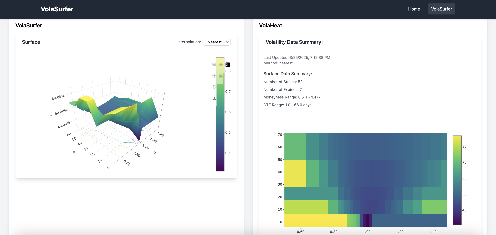

# VolaSurfer

VolaSurfer is a suite of options analysis tools designed for volatility analysis. This project aims to empower traders and analysts by providing comprehensive tools for market data analysis and decision-making.

## Key Features

- **Volatility Analysis**: Analyze market volatility and assess volatility surfaces to make informed trading decisions.
- **Data Integration**: Integrates various data storage solutions for efficient data management and retrieval.
- **Advanced Algorithms**: Utilizes sophisticated algorithms to process and visualize options data effectively.
- **Multi-Exchange Support**: Supports multiple exchanges, allowing users to access a wide range of market data.
- **User-Friendly Interface**: Focuses on providing an intuitive interface for ease of use by traders and analysts.



## Prerequisites

- Python 3.11.9
- PostgreSQL 14
- Node.js 22.11.0
- npm 11.1.0

## Installation

1. Clone the repository:
```bash
git clone https://github.com/Baerenstein/VolaSurfer.git
cd VolaSurfer
```

2. Set up a PostgreSQL database 
[see `postgres_setup.md`](doc/postgres_setup.md)

3. Navigate to the `backend` directory:
```bash
cd backend
```

4. Create a virtual environment and install dependencies:
```bash
python -m venv venv
source venv/bin/activate  # On Windows: venv\Scripts\activate
pip install -r requirements.txt
```

5. Run the data worker to collect data:
```bash
python -m core.MarketDataEngine
```

6. Start the backend server:
```bash
uvicorn server.app:app --host 0.0.0.0 --port 8000 --reload
```

## Configuration

Before starting the application, it is important to set the right URI for the database.

Go to `backend/infrastructure/settings.py` and adjust POSTGRES_URI to your specific database details.


## Frontend

The frontend is built with React and Next.js.

To run the frontend, navigate to the `frontend` directory and run:
```bash
npm install
npm run dev
```

## Contributing

Contributions are welcome! Here's how you can help:

1. Fork the repository
2. Create a feature branch (`git checkout -b fix/amazing-feature`)
3. Commit your changes (`git commit -m 'Add amazing feature'`)
4. Push to the branch (`git push origin feat/amazing-feature`)
5. Open a Pull Request

Please ensure your PR:
- All classes and methods have docstrings
- Includes unit tests
- Updates documentation as needed
- Describes the changes made and their purpose

[see `contributing.md`](doc/contributing.md) for more details.

## License

This project is licensed under the Apache-2.0 License - see the LICENSE file for details.