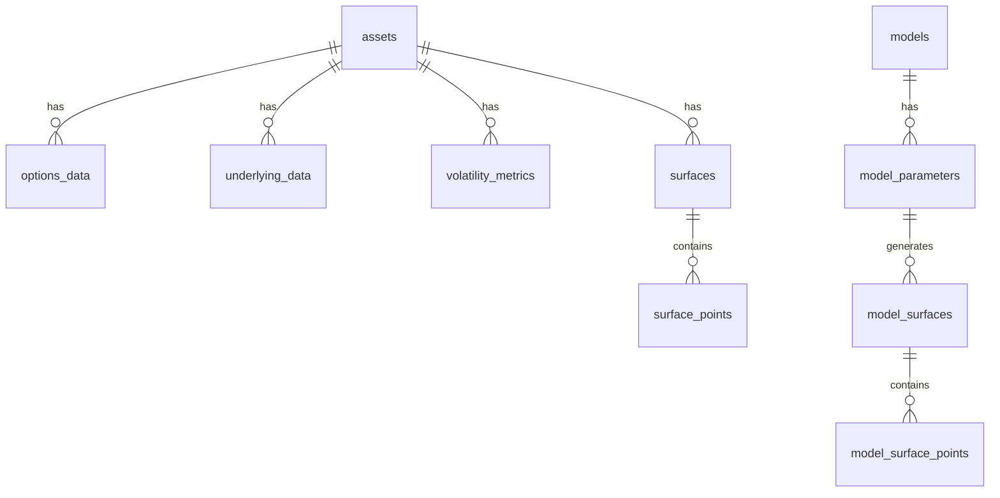

# PostgreSQL Data Store Architecture

## Overview
The PostgreSQL data store implementation manages financial market data, specifically focusing on options and volatility surfaces. This document outlines the database schema, table relationships, and key functionalities.

## Database Schema

### Tables Overview
1. **assets**
   - Primary table for tracking different financial instruments
   - Fields: `id`, `asset_type`, `ticker`
   - Unique constraint on `ticker`

2. **options_data**
   - Stores options chain data
   - Links to `assets` table via `asset_id`
   - Contains pricing, Greeks, and contract specifications
   - Key fields: `strike`, `moneyness`, `implied_vol`, `delta`, `gamma`, `vega`, `theta`

3. **underlying_data**
   - Tracks underlying asset prices
   - Links to `assets` table via `asset_id`
   - Stores timestamp-based price data

4. **volatility_metrics**
   - Stores volatility-related metrics and calculations
   - Contains historical volatility data and implied volatility indices
   - Supports JSON storage for flexible metric storage

5. **surfaces**
   - Manages volatility surface metadata
   - Links to `assets` table
   - Tracks calculation methods and timestamps

6. **surface_points**
   - Stores individual points that make up volatility surfaces
   - Links to `surfaces` table via `surface_id`
   - Contains strike, moneyness, and implied volatility data

7. **models**, **model_parameters**, **model_surfaces**, **model_surface_points**
   - Support for volatility model implementations
   - Store model configurations, parameters, and generated surfaces

## Table Relationships

## Key Functions

### Data Storage
- `store_underlying()`: Stores underlying asset price data
- `store_options_chain()`: Stores options chain data with precision control
- `store_surface()`: Stores volatility surface data

### Data Retrieval
- `get_underlying_data()`: Retrieves underlying price history
- `get_options_chain()`: Retrieves option contract data
- `get_vol_surfaces()`: Retrieves volatility surface data
- `get_latest_vol_surface()`: Retrieves most recent volatility surface

### Utility Functions
- `_limit_decimals()`: Controls decimal precision for numerical data
- `get_or_create_asset()`: Manages asset creation and retrieval

## Data Types

### OptionContract
Represents individual option contracts with:
- Contract specifications (strike, expiry, type)
- Pricing data (last_price, implied_vol)
- Greeks (delta, gamma, vega, theta)

### VolSurface
Represents volatility surfaces with:
- Surface points (strikes, maturities, implied_vols)
- Metadata (timestamp, method, snapshot_id)
- Asset reference
